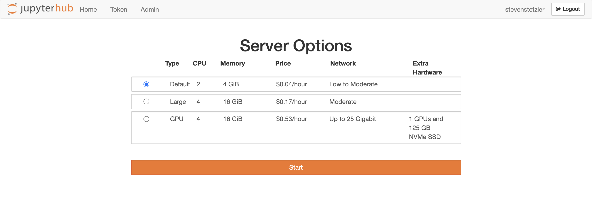
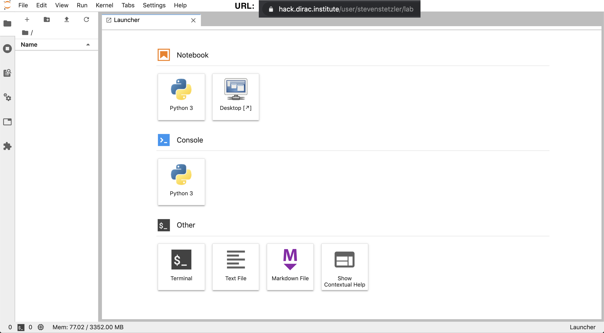

# Astro Hack Week 2020 JupyterHub

Contact: Steven Stetzler ([stevengs@uw.edu](mailto:stevengs@uw.edu))

The DiRAC Institute at the University of Washington has set up infrastructure for a shared computing environment, a JupyterHub, to support Astro Hack Week 2020. Participants of the Hack Week are able to use this infrastructure to gain access to computing resources and shared file systems to showcase demos and collaborate on hacks.

## Obtaining an Account and Logging In

The JupyterHub authenticates users using GitHub, so to gain access, you must have a GitHub account. Second, only users who are a part of the [AstroHackWeek2020](https://github.com/AstroHackWeek2020) GitHub organization will be allowed on the system. To gain access to the system, follow these steps:

1. Create a GitHub account: [https://github.com/join?source=login](https://github.com/join?source=login)
2. Join the AstroHackWeek2020 GitHub organization / share your GitHub username with an administrator and wait to receive an invitiation to the organization
3. Log-in at: [https://hack.dirac.institute/hub/login](https://hack.dirac.institute/hub/login)

## Launching a Server

After logging in, you will be sent to a page where you can select the type of computing resource you desire:

There are three server options:
1. Default: a small machine
2. Large: a larger machine if you require more computing resources
3. GPU: a larger machine with a GPU available for use.
(If you need a larger/different server, contact Steven Stetzler at [stevengs@uw.edu](mailto:stevengs@uw.edu).)

Choose the default option and click "Start" to start your server. You will see a progress bar along with messages about the server launching process. It may take a 2-3 minutes for your server to launch.

When your server successfully spawns, you will see the Jupyter notebook interface. The root directory shown in the file system interface is the home directory on your server: `/home/{username}`.

To use the JupyterLab interface, simply replace `tree` with `lab` in the URL

## Stopping your Server

To stop or restart your server, navigate to [https://hack.dirac.institute/hub/home](https://hack.dirac.institute/hub/home). To stop the server, click "Stop My Server". To start your server, click "Start My Server".

## Collaborating and Sharing Data

The servers spawned by each individual user is connected to a central, shared file system that you can use to share notebooks and data with others. To navigate this file system, open a terminal and type `ls /home`:

